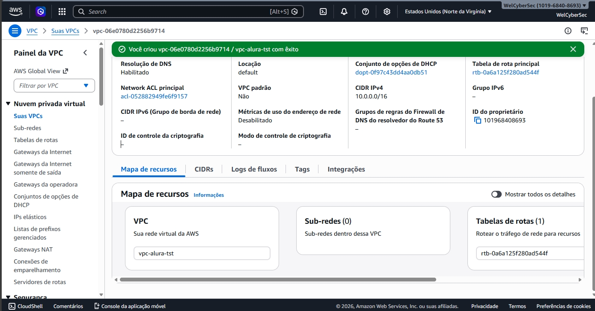
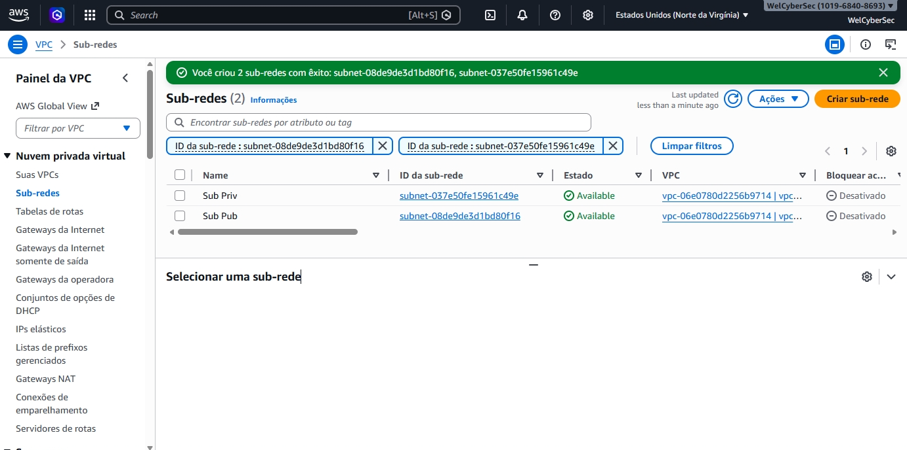
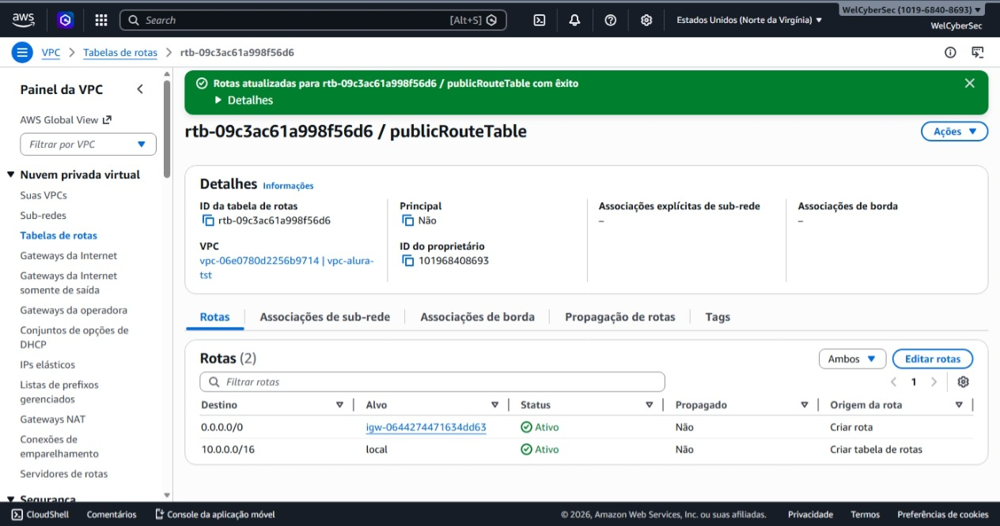
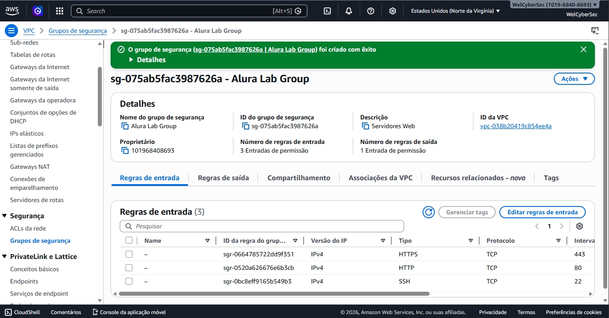
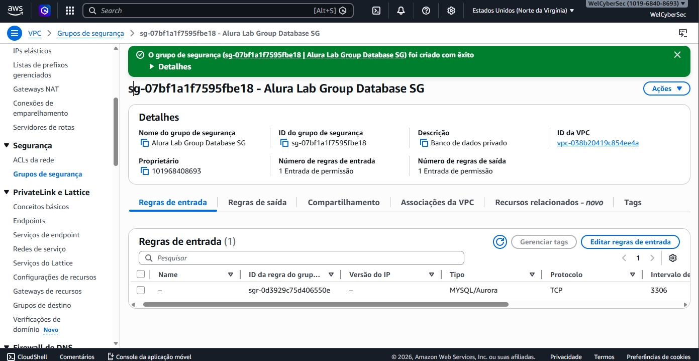
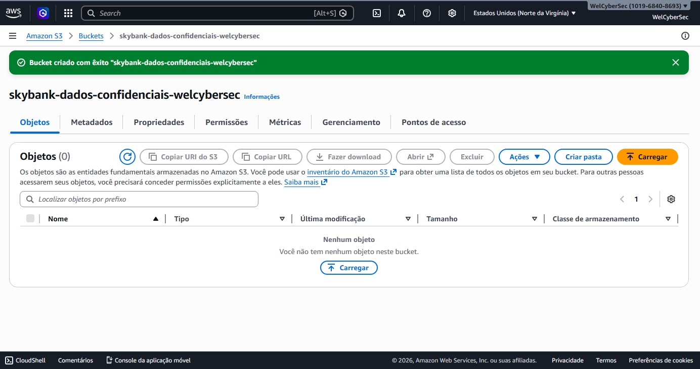

# aws-cloud-security-minilab
Mini laboratório prático de Cloud Security na AWS: criação de VPC, sub-redes públicas/privadas, IGW, tabelas de rota, Security Groups, IAM seguro, bucket S3 sem exposição pública e MFA no root e admins.

# 🛡️ AWS Cloud Security MiniLab  
### Arquitetura segura na nuvem com VPC, IAM, Security Groups e S3

Este repositório documenta um mini laboratório prático focado em **Cloud Security na AWS**, cobrindo os principais pilares de segurança em ambientes de nuvem:

- ✅ Proteção da conta raiz (root)  
- ✅ Implementação de boas práticas de IAM / Least Privilege  
- ✅ Criação de uma VPC isolada com sub-redes públicas e privadas  
- ✅ Configuração de tabelas de rota e Internet Gateway  
- ✅ Firewalls (Security Groups) isolando camadas Web e Database  
- ✅ Armazenamento seguro com S3 totalmente privado e criptografado  
- ✅ Auditoria manual estilo CIS / CSPM  

Este projeto simula como construir uma arquitetura simples e segura seguindo princípios profissionais de segurança em cloud.

---

## 📌 Objetivo do Lab

Criar uma arquitetura mínima e segura na AWS que implemente:

- Isolamento de rede (public vs private subnets)  
- Zero Trust entre camadas (Web → Database)  
- Bloqueio total de exposição indevida  
- IAM seguro sem uso do root  
- S3 com criptografia e sem acesso público  

---

# 🏗️ **Arquitetura Criada (Resumo)**

``

       Internet            │
       └──────────────┬────────────┘
                      │
               (IGW - Internet Gateway)
                      │
            ┌─────────┴──────────┐
            │   Sub-rede Pública │ 10.0.1.0/24
            │  EC2 (Servidor Web)│
            │  SG: Web-SG        │
            └─────────┬──────────┘
                      │ Permitido
                      ▼
            ┌─────────┴──────────┐
            │  Sub-rede Privada  │ 10.0.2.0/24
            │ EC2 (Banco de Dados) 
            │ SG: Database-SG
            └─────────┬──────────┘
                      │
                      ▼
         (Nenhum acesso direto à Internet)

         ---

# ✅ **1. Proteção da Conta Root**

- MFA configurado no root  
- Root não é mais utilizado para tarefas administrativas  
- Criado usuário IAM **cloud-sec-admin** com:
  - Política `AdministratorAccess`
  - MFA ativado  

---

# ✅ **2. IAM e Princípio do Menor Privilégio**

### Criado grupo **Developers** com:
- Permissões de EC2 limitadas  
- Acesso somente leitura ao S3 (`AmazonS3ReadOnlyAccess`)  
- Sem permissão para IAM, Redes ou Billing  

---

# ✅ **3. Criação da VPC Segura**

- VPC CIDR: `10.0.0.0/16`
- Sub-rede Pública: `10.0.1.0/24`
- Sub-rede Privada: `10.0.2.0/24`
- Internet Gateway criado e associado
- Route Tables:
  - **Public-RT** → rota `0.0.0.0/0` → IGW
  - **Private-RT** → apenas rota local

✅ **Instâncias na sub-rede privada NÃO possuem IP público.**

---

# ✅ **4. Firewall com Security Groups (Stateful)**

### **Web-SG (camada pública)**  
✅ HTTP (80) → 0.0.0.0/0  
✅ HTTPS (443) → 0.0.0.0/0  
✅ SSH (22) → somente *meu IP*  

### **Database-SG (camada privada)**  
✅ Porta 3306 (MySQL) ou 5432 (Postgres)  
✅ Origem: **Web-SG**  
❌ Nunca exposto para 0.0.0.0/0  

---

# ✅ **5. Armazenamento Seguro (S3)**

Bucket criado:  
✔ `skybank-dados-confidenciais-seunome`

Configurações:

- ✅ Block Public Access **ATIVADO**
- ✅ Criptografia padrão **SSE-S3 habilitada**
- ✅ Teste de auditoria:
  - A URL padrão retorna **Access Denied** (correto)
  - Nenhum objeto pode ser acessado anonimamente

---

# ✅ **6. Auditoria Estilo CSPM (Manual)**

Verificações realizadas:

### ✅ Security Groups
- Nenhuma regra inbound com `0.0.0.0/0`, exceto portas públicas no Web-SG  
- Database-SG expõe apenas para Web-SG

### ✅ S3
- Bucket completamente privado  
- Sem ACL aberta  
- Sem políticas públicas  
- Criptografia ativada

### ✅ IAM
- Root protegido  
- Usuários com MFA  
- Least Privilege implementado  

Tudo **conforme CIS AWS Foundations**.

---

# 📂 **Evidências (Prints)**

Os prints utilizados estão na pasta `/prints`.  
Eles mostram:

- VPC criada  
- Sub-redes  
- Rotas  
- IGW  
- IAM  
- MFA do root  
- Security Groups  
- Bucket S3  
- Auditoria de acesso negado  

---

# ✅ **Como Reproduzir Esse Lab**

### 1. Criar IAM seguro  
### 2. Criar VPC com 2 sub-redes  
### 3. Criar route tables e IGW  
### 4. Criar SGs (Web → Database)  
### 5. Criar bucket S3 seguro  
### 6. Validar com auditoria manual  

(Os passos completos estão descritos neste README.)

---

# 📚 **Lições Aprendidas**

- Importância do MFA no root  
- Não usar root nunca mais  
- Criar redes isoladas na AWS  
- Configurar SGs como firewalls stateful  
- Diferença entre sub-rede pública e privada  
- Evitar IPs públicos acidentalmente  
- S3 público = falha crítica em qualquer auditoria  
- Implementar least privilege corretamente  

---

# ✅ **Status do Projeto**  
✔ Concluído com sucesso  
✔ Auditoria própria e postagem no fórum na Alura aprovada  

---

# 🙋 Sobre o autor

Laboratório criado por **Welber Ferreira como parte dos estudos em Cloud Security & AWS.

## 📸 Evidências do Lab

### ✅ VPC criada

### ✅ Sub-redes pública e privada

### ✅ Route Table pública com IGW

### ✅ Security Group da camada Web

### ✅ Security Group da camada Database

### ✅ Bucket S3 privado e criptografado

